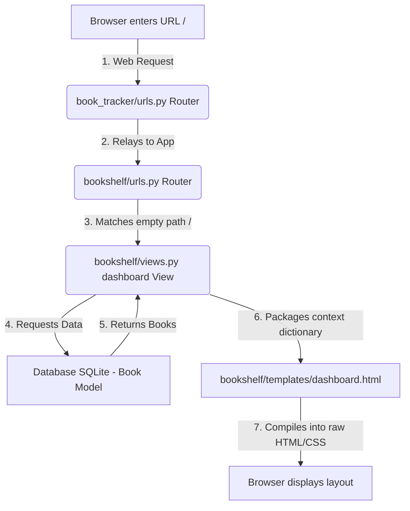

# 📘 The Django "Read Next" Book Tracker: A Beginner's Step-by-Step Learning Guide

Welcome to your Django learning journey! This guide is designed specifically for **Python beginners**. Rather than just giving you a pile of finished code, this interactive guide acts as your personal instructor. 

We will break down **every single step** of building "The 'Read Next' Book Tracker." We'll cover **what** commands to run, **what** code to write, **why** we write it that way, and **how** it all connects behind the scenes.

Let's get started!

---

## 🗺️ Project Blueprint: What We Are Building
"Read Next" is a web app that helps you manage your digital bookshelf. It will have:
1. **The Dashboard**: A beautiful, organized view showing three lists of books: *To Read*, *Currently Reading*, and *Completed*.
2. **Quick Actions**: One-click buttons to instantly update a book's status (e.g., from *To Read* to *Currently Reading*).
3. **Favorites Section**: A dedicated tab featuring only the books you've marked as *Completed* and rated **5 out of 5 stars**.
4. **Interactive Form**: An easy way to add new books to your bookshelf.

---

## 🛠️ Step 1: Setting Up Your Environment & Project

Before writing Python code, we need to build the "workspace" on your computer. Since you are on **Windows**, we will use Windows-specific terminal commands!

### 1. Why do we need a "Virtual Environment"?
Imagine you have multiple Python projects. Project A uses Django version 3.2, but Project B uses Django version 5.0. If you install Django globally on your computer, they will clash. 
A **Virtual Environment (`venv`)** is a private, isolated container for your project. Any library (like Django) installed inside it won't affect the rest of your computer or other projects.

### 💻 The Terminal Commands:
Open your terminal (PowerShell or Command Prompt) in your project directory (`C:\Users\awhaz\Documents\Systems\pyco`) and run:

```powershell
# 1. Create a virtual environment named "venv"
python -m venv venv

# 2. Activate the virtual environment (Windows-specific command!)
venv\Scripts\activate
```

> [!NOTE]
> Once activated, you should see `(venv)` at the beginning of your terminal prompt. This means anything you install now stays isolated inside this project!

### 3. Installing Django and Creating the Project
Now we will install Django inside our environment and generate our project skeleton.

```powershell
# 3. Install Django using pip (Python's package manager)
pip install django

# 4. Initialize a new Django project named "book_tracker" in the current directory
django-admin startproject book_tracker .
```
> [!IMPORTANT]
> **Why the dot `.` at the end?**
> The `.` tells Django to create the project configuration files *directly* in your current folder, rather than creating another nested directory. This keeps your folder structure clean!

### 4. Creating Your Django "App"
In Django, a **Project** is the entire website. An **App** is a self-contained module that does a specific task. A project can have many apps (e.g., `blog`, `billing`, `store`). We will create an app named `bookshelf`.

```powershell
# 5. Create the bookshelf app
python manage.py startapp bookshelf
```

Your directory structure will now look like this:
```text
pyco/
├── venv/                 # Your virtual environment files
├── book_tracker/         # Core project settings (settings.py, urls.py)
│   ├── __init__.py
│   ├── asgi.py
│   ├── settings.py       # Crucial configurations
│   ├── urls.py           # Main URL director
│   └── wsgi.py
├── bookshelf/            # Your app's files (where our code lives!)
│   ├── migrations/       # Keeps track of database changes
│   ├── __init__.py
│   ├── admin.py          # Admin interface registration
│   ├── apps.py
│   ├── models.py         # Database blueprint (Most important first step)
│   ├── tests.py
│   └── views.py          # App logic
└── manage.py             # Django's administrative tool
```

---

## ⚙️ Step 2: Registering Your App
Django needs to be told that our new `bookshelf` app exists. 

### 📁 File to Edit: [book_tracker/settings.py](file:///c:/Users/awhaz/Documents/Systems/pyco/book_tracker/settings.py)
Open `settings.py` and scroll down to the `INSTALLED_APPS` list. Add `'bookshelf',` at the bottom of the list:

```python
INSTALLED_APPS = [
    'django.contrib.admin',
    'django.contrib.auth',
    'django.contrib.contenttypes',
    'django.sessions',
    'django.messages',
    'django.contrib.staticfiles',
    # Register your new app here:
    'bookshelf',
]
```

---

## 🗄️ Step 3: Designing the Database Model
A **Model** in Django is the single source of truth about your data. Django uses Object-Relational Mapping (ORM), which means you write the database structure in standard Python code, and Django automatically translates it into database tables (like SQLite, PostgreSQL) for you.

Let's build a model for our `Book`.

### 📁 File to Edit: [bookshelf/models.py](file:///c:/Users/awhaz/Documents/Systems/pyco/bookshelf/models.py)
Replace the contents of this file with:

```python
from django.db import models
from django.core.validators import MinValueValidator, MaxValueValidator

class Book(models.Model):
    # 1. Status choices: A list of tuples. 
    # Left value is what goes in the database; Right value is human-readable.
    STATUS_CHOICES = [
        ('TO_READ', 'To Read'),
        ('READING', 'Currently Reading'),
        ('COMPLETED', 'Finished / Completed'),
    ]

    # 2. Database Fields (Columns)
    title = models.CharField(max_length=200)
    author = models.CharField(max_length=150)
    
    status = models.CharField(
        max_length=10, 
        choices=STATUS_CHOICES, 
        default='TO_READ'
    )
    
    # Rating can be empty (null=True) because "To Read" or "Reading" books aren't rated yet.
    # blank=True allows us to submit a form without a rating.
    # Validators ensure ratings are strictly between 1 and 5.
    rating = models.IntegerField(
        null=True, 
        blank=True, 
        validators=[MinValueValidator(1), MaxValueValidator(5)]
    )

    # 3. String representation
    def __str__(self):
        return f"{self.title} by {self.author} ({self.get_status_display()})"
```

### 🧠 Why did we write it this way?
* **`models.Model`**: By inheriting from this, we tell Django that this Python class is a database model. Django will automatically add a unique ID auto-incrementing field (Primary Key) for us!
* **`max_length`**: Database engines need to know how much memory space to allocate for characters. `CharField` always requires a `max_length` limit.
* **`choices=STATUS_CHOICES`**: This limits the values of `status` to only the options in our list, preventing typos.
* **`null=True` vs `blank=True`**:
  * `null=True`: Databases usually require fields to have a value. This allows the database column to store `NULL` (empty/nothing).
  * `blank=True`: This is for Django forms. It tells Django's validation that it's okay to submit a form where this field is empty.
* **`__str__(self)`**: This is a special Python method. If Django wants to print a book (like in the Admin panel), it will run this method. Instead of seeing `<Book Object (1)>`, you will see `"The Hobbit by J.R.R. Tolkien (To Read)"`.
* **`get_status_display()`**: This is a helper method Django generates automatically for choices. It prints the human-readable text (e.g., `'Currently Reading'`) instead of the database code (`'READING'`).

---

## ⚡ Step 4: Activating the Database (Migrations)
Now that our model is written, we need to instruct Django to actually create the table inside our database. We do this with **Migrations**.

Migrations are like version control (like Git) but for your database.
1. **`makemigrations`** looks at your `models.py` files, compares them to what they used to be, and generates a blueprint file (in the `migrations/` folder) of the changes.
2. **`migrate`** reads those blueprint files and actually applies those changes to the database.

### 💻 The Terminal Commands:
Run these commands in your activated terminal:

```powershell
# 1. Create migration blueprints
python manage.py makemigrations

# 2. Apply blueprints to the SQLite database
python manage.py migrate
```

---

## 👑 Step 5: Setting Up Django Admin
Django comes out of the box with a fully-functional admin dashboard. This lets you immediately add, edit, and delete books in your database without writing any HTML!

### 📁 File to Edit: [bookshelf/admin.py](file:///c:/Users/awhaz/Documents/Systems/pyco/bookshelf/admin.py)
Open `admin.py` and register the `Book` model so it shows up in the admin control panel:

```python
from django.contrib import admin
from .models import Book

# Register the Book model
admin.site.register(Book)
```

### 💻 Create Your Admin User:
To log into the admin dashboard, we need a "superuser" account. Run the following command and follow the terminal prompts (choose a username, email, and password):

```powershell
python manage.py createsuperuser
```
*(Note: When typing the password, characters will be hidden for security. Just type it and hit Enter!)*

---

## 🗺️ Step 6: Setting Up Routing & URLs
When a user types a URL (like `http://127.0.0.1:8000/favorites/`) in their browser, Django needs to know which view (Python function) should handle it.

We will configure this in two files:
1. **Project-level URL file**: Directs matching web traffic to our app's directory.
2. **App-level URL file**: Directs specific paths to our view functions.

### 📁 File to Edit: [book_tracker/urls.py](file:///c:/Users/awhaz/Documents/Systems/pyco/book_tracker/urls.py)
Replace the code in this project-level file:

```python
from django.contrib import admin
from django.urls import path, include

urlpatterns = [
    path('admin/', admin.site.register),
    # This redirects all traffic (except /admin/) to our bookshelf app URLs
    path('', include('bookshelf.urls')),
]
```

### 📁 File to Create: [bookshelf/urls.py](file:///c:/Users/awhaz/Documents/Systems/pyco/bookshelf/urls.py)
Create a new file called `urls.py` inside the `bookshelf` directory and add:

```python
from django.urls import path
from . import views

urlpatterns = [
    # 1. The Dashboard (Home page)
    path('', views.dashboard, name='dashboard'),
    
    # 2. Favorites Page
    path('favorites/', views.favorites, name='favorites'),
    
    # 3. Add Book Page
    path('add/', views.add_book, name='add_book'),
    
    # 4. Quick Action URL: Move book from To Read -> Reading
    # <int:book_id> acts as a placeholder. E.g., 'start-reading/3/' runs the view for book ID 3.
    path('start-reading/<int:book_id>/', views.start_reading, name='start_reading'),
    
    # 5. Quick Action URL: Mark book as Completed (and give it a rating)
    path('complete-reading/<int:book_id>/', views.complete_reading, name='complete_reading'),
]
```

---

## 🧠 Step 7: Creating the View Logic (Views)
A **View** is a Python function that takes a Web Request, processes it (talks to the database, runs code), and returns a Web Response (renders HTML templates or redirects URLs).

We need 5 views:
1. **`dashboard`**: Renders all books, separated by their status.
2. **`favorites`**: Renders only books rated exactly 5 stars.
3. **`add_book`**: Handles both rendering the form and saving the book if the form is submitted.
4. **`start_reading`**: Instantly switches status to "Currently Reading" and redirects back to dashboard.
5. **`complete_reading`**: Captures rating, marks as "Completed", and redirects.

### 📁 File to Edit: [bookshelf/views.py](file:///c:/Users/awhaz/Documents/Systems/pyco/bookshelf/views.py)
Replace the contents with the following:

```python
from django.shortcuts import render, redirect, get_object_or_404
from .models import Book
from .forms import BookForm

# 1. DASHBOARD VIEW
def dashboard(request):
    # Query database and filter books based on status
    to_read_books = Book.objects.filter(status='TO_READ')
    reading_books = Book.objects.filter(status='READING')
    completed_books = Book.objects.filter(status='COMPLETED')
    
    # Context is a dictionary that carries database variables over to the HTML template
    context = {
        'to_read': to_read_books,
        'reading': reading_books,
        'completed': completed_books,
    }
    return render(request, 'bookshelf/dashboard.html', context)

# 2. FAVORITES VIEW (Only 5-star books)
def favorites(request):
    # Filter books where rating is exactly 5
    fav_books = Book.objects.filter(rating=5)
    return render(request, 'bookshelf/favorites.html', {'favorites': fav_books})

# 3. ADD BOOK VIEW
def add_book(request):
    if request.method == 'POST':
        # If the user submitted the form, populate the BookForm with the submitted data
        form = BookForm(request.POST)
        if form.is_valid():
            # If the data entered is correct, save it directly to the database
            form.save()
            return redirect('dashboard')
    else:
        # If they just visited the page, give them a blank form
        form = BookForm()
        
    return render(request, 'bookshelf/add_book.html', {'form': form})

# 4. QUICK ACTION: START READING (To Read -> Reading)
def start_reading(request, book_id):
    # Fetch the book by its unique ID. If not found, show a 404 Error page.
    book = get_object_or_404(Book, id=book_id)
    book.status = 'READING'
    book.save() # Crucial! This saves the change back to the database.
    return redirect('dashboard')

# 5. QUICK ACTION: COMPLETE READING (Reading -> Completed + Rating)
def complete_reading(request, book_id):
    book = get_object_or_404(Book, id=book_id)
    
    # Since we need a rating to complete, we read it from the submission form (using POST)
    if request.method == 'POST':
        rating = request.POST.get('rating')
        if rating:
            book.rating = int(rating)
        book.status = 'COMPLETED'
        book.save()
        
    return redirect('dashboard')
```

---

## 📝 Step 8: Creating Django Forms
Django has a powerful form utility. We don't have to manually write HTML input tags. We can create a `ModelForm`, which will automatically check our `Book` model and generate the correct HTML input types (e.g., text inputs for titles, select dropdowns for choices)!

### 📁 File to Create: [bookshelf/forms.py](file:///c:/Users/awhaz/Documents/Systems/pyco/bookshelf/forms.py)
Create a new file `forms.py` in your `bookshelf` app folder and write:

```python
from django import forms
from .models import Book

class BookForm(forms.ModelForm):
    class Meta:
        model = Book
        # Expose these fields in the HTML Form
        fields = ['title', 'author', 'status', 'rating']
        
        # Optional: Add custom styling classes to the form inputs
        widgets = {
            'title': forms.TextInput(attrs={'class': 'form-input', 'placeholder': 'Enter book title'}),
            'author': forms.TextInput(attrs={'class': 'form-input', 'placeholder': 'Enter author name'}),
            'status': forms.Select(attrs={'class': 'form-select'}),
            'rating': forms.NumberInput(attrs={'class': 'form-input', 'min': 1, 'max': 5, 'placeholder': 'Rating (1-5, Optional)'}),
        }
```

---

## 🎨 Step 9: Creating the Templates (Frontend UI)
Django templates look like standard HTML, but they contain extra tags (like `` and ``) that let us render database fields and apply **conditional logic**.

First, let's create our templates directory structure inside the `bookshelf` folder:
```text
bookshelf/
└── templates/
    └── bookshelf/
        ├── base.html         # The layout shell (navbar, footer, global styles)
        ├── dashboard.html    # The dashboard showing categorized shelves
        ├── favorites.html    # The 5-star books view
        └── add_book.html     # The form view to add books
```

Let's build these step-by-step.

### 1. The Global Shell: [bookshelf/templates/bookshelf/base.html](file:///c:/Users/awhaz/Documents/Systems/pyco/bookshelf/templates/bookshelf/base.html)
This template defines the header, navbar, footer, and basic layout. Other pages will **inherit** (``) this base file.

Create this file and add:

```html
<!DOCTYPE html>
<html lang="en">
<head>
    <meta charset="UTF-8">
    <meta name="viewport" content="width=device-width, initial-scale=1.0">
    <title>Read Next | Book Tracker</title>
    <!-- Add Google Fonts -->
    <link href="https://fonts.googleapis.com/css2?family=Outfit:wght@300;400;500;700&display=swap" rel="stylesheet">
    
    <style>
        :root {
            --bg-color: #0f172a;
            --card-bg: #1e293b;
            --primary-accent: #6366f1;
            --success-accent: #10b981;
            --star-accent: #f59e0b;
            --text-main: #f8fafc;
            --text-secondary: #94a3b8;
            --border-color: #334155;
            --transition: all 0.3s cubic-bezier(0.4, 0, 0.2, 1);
        }

        * {
            box-sizing: border-box;
            margin: 0;
            padding: 0;
            font-family: 'Outfit', sans-serif;
        }

        body {
            background-color: var(--bg-color);
            color: var(--text-main);
            min-height: 100vh;
            display: flex;
            flex-direction: column;
            line-height: 1.6;
        }

        /* Header / Navbar Styling */
        header {
            background-color: rgba(30, 41, 59, 0.7);
            backdrop-filter: blur(12px);
            border-bottom: 1px solid var(--border-color);
            position: sticky;
            top: 0;
            z-index: 10;
        }

        nav {
            max-width: 1200px;
            margin: 0 auto;
            padding: 1.2rem 2rem;
            display: flex;
            justify-content: space-between;
            align-items: center;
        }

        .logo {
            font-size: 1.5rem;
            font-weight: 700;
            background: linear-gradient(to right, #818cf8, #a5b4fc);
            -webkit-background-clip: text;
            -webkit-text-fill-color: transparent;
            text-decoration: none;
            letter-spacing: -0.5px;
        }

        .nav-links {
            display: flex;
            gap: 1.5rem;
            list-style: none;
        }

        .nav-links a {
            color: var(--text-secondary);
            text-decoration: none;
            font-weight: 500;
            padding: 0.5rem 1rem;
            border-radius: 8px;
            transition: var(--transition);
        }

        .nav-links a:hover, .nav-links a.active {
            color: var(--text-main);
            background-color: var(--border-color);
        }

        .cta-btn {
            background-color: var(--primary-accent);
            color: white !important;
        }

        .cta-btn:hover {
            background-color: #4f46e5;
            box-shadow: 0 0 15px rgba(99, 102, 241, 0.4);
        }

        /* Container and Content */
        main {
            flex: 1;
            width: 100%;
            max-width: 1200px;
            margin: 2rem auto;
            padding: 0 2rem;
        }

        footer {
            text-align: center;
            padding: 2rem;
            border-top: 1px solid var(--border-color);
            color: var(--text-secondary);
            font-size: 0.9rem;
            background-color: #0b0f19;
        }
    </style>
</head>
<body>
    <header>
        <nav>
            <a href="" class="logo">📚 Read Next</a>
            <ul class="nav-links">
                <li><a href="">Dashboard</a></li>
                <li><a href="">⭐ Favorites</a></li>
                <li><a href="" class="cta-btn">Add Book</a></li>
            </ul>
        </nav>
    </header>

    <main>
        <!-- This is a placeholder block. Child pages will inject their custom HTML inside here! -->
        
        
    </main>

    <footer>
        <p>&copy; 2026 Read Next App. Learn Django step-by-step!</p>
    </footer>
</body>
</html>
```

### 2. The Dashboard Template: [bookshelf/templates/bookshelf/dashboard.html](file:///c:/Users/awhaz/Documents/Systems/pyco/bookshelf/templates/bookshelf/dashboard.html)
This is our home page. It imports `base.html` and uses **loops** and **conditionals** to build three bookshelves side-by-side. It also contains our interactive quick-actions.

Create this file and add:

```html



<style>
    .shelves-container {
        display: grid;
        grid-template-columns: repeat(auto-fit, minmax(320px, 1fr));
        gap: 2rem;
        margin-top: 1.5rem;
    }

    .shelf {
        background-color: rgba(30, 41, 59, 0.4);
        border: 1px solid var(--border-color);
        border-radius: 16px;
        padding: 1.5rem;
        min-height: 400px;
        display: flex;
        flex-direction: column;
    }

    .shelf-title {
        font-size: 1.25rem;
        font-weight: 600;
        margin-bottom: 1.25rem;
        display: flex;
        align-items: center;
        gap: 0.5rem;
        border-bottom: 2px solid var(--border-color);
        padding-bottom: 0.5rem;
    }

    .shelf-count {
        font-size: 0.8rem;
        background-color: var(--border-color);
        padding: 2px 8px;
        border-radius: 20px;
        color: var(--text-secondary);
    }

    .book-card {
        background-color: var(--card-bg);
        border: 1px solid var(--border-color);
        border-radius: 12px;
        padding: 1.2rem;
        margin-bottom: 1rem;
        box-shadow: 0 4px 6px rgba(0, 0, 0, 0.1);
        transition: var(--transition);
        position: relative;
    }

    .book-card:hover {
        transform: translateY(-4px);
        border-color: var(--primary-accent);
        box-shadow: 0 8px 16px rgba(99, 102, 241, 0.15);
    }

    .book-title {
        font-size: 1.1rem;
        font-weight: 600;
        color: var(--text-main);
        margin-bottom: 0.2rem;
    }

    .book-author {
        font-size: 0.9rem;
        color: var(--text-secondary);
        margin-bottom: 1rem;
    }

    /* Actions & Forms inside Cards */
    .actions {
        display: flex;
        justify-content: flex-end;
    }

    .action-btn {
        display: inline-flex;
        align-items: center;
        gap: 0.4rem;
        background-color: var(--primary-accent);
        color: white;
        border: none;
        padding: 0.5rem 0.9rem;
        font-size: 0.85rem;
        font-weight: 500;
        border-radius: 8px;
        cursor: pointer;
        text-decoration: none;
        transition: var(--transition);
    }

    .action-btn:hover {
        opacity: 0.9;
    }

    .success-btn {
        background-color: var(--success-accent);
    }

    .rating-form {
        width: 100%;
        display: flex;
        flex-direction: column;
        gap: 0.5rem;
    }

    .rating-select-group {
        display: flex;
        align-items: center;
        gap: 0.5rem;
    }

    .rating-select {
        background-color: var(--bg-color);
        border: 1px solid var(--border-color);
        color: var(--text-main);
        padding: 0.3rem;
        border-radius: 6px;
        font-size: 0.9rem;
    }

    .stars {
        color: var(--star-accent);
        font-size: 1rem;
        margin-bottom: 0.5rem;
    }

    .empty-shelf {
        color: var(--text-secondary);
        font-style: italic;
        text-align: center;
        margin: auto 0;
        padding: 2rem 0;
    }
</style>

<h1 style="font-weight: 700; margin-bottom: 0.5rem;">My Bookshelf</h1>
<p style="color: var(--text-secondary);">Track your reading progress and manage your collection dynamically.</p>

<div class="shelves-container">
    
    <!-- 📚 SHELF 1: TO READ -->
    <div class="shelf">
        <h2 class="shelf-title">📖 To Read <span class="shelf-count">{{ to_read.count }}</span></h2>
        
            
                <div class="book-card">
                    <div class="book-title">{{ book.title }}</div>
                    <div class="book-author">by {{ book.author }}</div>
                    <div class="actions">
                        <!-- Quick action link redirects to the start_reading view -->
                        <a href="" class="action-btn">
                            Start Reading ➔
                        </a>
                    </div>
                </div>
            
        
            <p class="empty-shelf">No books waiting. Add one to get started!</p>
        
    </div>

    <!-- 📚 SHELF 2: CURRENTLY READING -->
    <div class="shelf">
        <h2 class="shelf-title">✨ Reading <span class="shelf-count">{{ reading.count }}</span></h2>
        
            
                <div class="book-card">
                    <div class="book-title">{{ book.title }}</div>
                    <div class="book-author">by {{ book.author }}</div>
                    <div class="actions">
                        <!-- Clicking this submits a rating form to complete the book -->
                        <form action="" method="POST" class="rating-form">
                            
                            <div class="rating-select-group">
                                <label for="rating-{{ book.id }}" style="font-size: 0.85rem; color: var(--text-secondary);">Rate: </label>
                                <select name="rating" id="rating-{{ book.id }}" class="rating-select" required>
                                    <option value="5">⭐⭐⭐⭐⭐ (5)</option>
                                    <option value="4">⭐⭐⭐⭐ (4)</option>
                                    <option value="3">⭐⭐⭐ (3)</option>
                                    <option value="2">⭐⭐ (2)</option>
                                    <option value="1">⭐ (1)</option>
                                </select>
                                <button type="submit" class="action-btn success-btn">Finish</button>
                            </div>
                        </form>
                    </div>
                </div>
            
        
            <p class="empty-shelf">You aren't reading anything right now.</p>
        
    </div>

    <!-- 📚 SHELF 3: COMPLETED -->
    <div class="shelf">
        <h2 class="shelf-title">✅ Finished <span class="shelf-count">{{ completed.count }}</span></h2>
        
            
                <div class="book-card">
                    <div class="book-title">{{ book.title }}</div>
                    <div class="book-author">by {{ book.author }}</div>
                    
                        <div class="stars">
                            <!-- Loop to print stars based on rating -->
                            ⭐
                        </div>
                    
                </div>
            
        
            <p class="empty-shelf">No books finished yet. Keep turning pages!</p>
        
    </div>

</div>

```

### 3. The Favorites Page: [bookshelf/templates/bookshelf/favorites.html](file:///c:/Users/awhaz/Documents/Systems/pyco/bookshelf/templates/bookshelf/favorites.html)
This is a dedicated page displaying only the absolute best (5-star) books from the bookshelf.

Create this file and add:

```html



<style>
    .favorites-grid {
        display: grid;
        grid-template-columns: repeat(auto-fill, minmax(280px, 1fr));
        gap: 1.5rem;
        margin-top: 1.5rem;
    }

    .fav-card {
        background: linear-gradient(135deg, rgba(245, 158, 11, 0.1), rgba(30, 41, 59, 0.8));
        border: 1px solid rgba(245, 158, 11, 0.3);
        border-radius: 16px;
        padding: 1.5rem;
        transition: var(--transition);
        position: relative;
        overflow: hidden;
    }

    .fav-card::before {
        content: '⭐';
        position: absolute;
        right: -10px;
        bottom: -10px;
        font-size: 5rem;
        opacity: 0.08;
    }

    .fav-card:hover {
        transform: translateY(-5px) scale(1.02);
        box-shadow: 0 8px 24px rgba(245, 158, 11, 0.2);
    }

    .fav-title {
        font-size: 1.25rem;
        font-weight: 700;
        margin-bottom: 0.3rem;
    }

    .fav-author {
        color: var(--text-secondary);
        font-size: 0.95rem;
        margin-bottom: 1rem;
    }

    .stars {
        color: var(--star-accent);
        font-size: 1.2rem;
    }

    .empty-fav {
        text-align: center;
        padding: 5rem 2rem;
        background-color: var(--card-bg);
        border: 1px solid var(--border-color);
        border-radius: 16px;
        color: var(--text-secondary);
        max-width: 600px;
        margin: 3rem auto 0 auto;
    }
</style>

<h1 style="font-weight: 700; margin-bottom: 0.5rem;">⭐ Favorites Hall of Fame</h1>
<p style="color: var(--text-secondary);">Your absolute favorite books rated 5 stars.</p>


    <div class="favorites-grid">
        
            <div class="fav-card">
                <div class="fav-title">{{ book.title }}</div>
                <div class="fav-author">by {{ book.author }}</div>
                <div class="stars">⭐⭐⭐⭐⭐</div>
            </div>
        
    </div>

    <div class="empty-fav">
        <h2 style="margin-bottom: 1rem; color: var(--text-main);">No Legends Yet</h2>
        <p>Give a book a 5-star rating when finishing it, and it will be permanently immortalized here!</p>
    </div>


```

### 4. The Form Page: [bookshelf/templates/bookshelf/add_book.html](file:///c:/Users/awhaz/Documents/Systems/pyco/bookshelf/templates/bookshelf/add_book.html)
This template renders the model-driven form so the user can easily input books.

Create this file and add:

```html



<style>
    .form-container {
        max-width: 600px;
        margin: 3rem auto 0 auto;
        background-color: var(--card-bg);
        border: 1px solid var(--border-color);
        border-radius: 16px;
        padding: 2.5rem;
        box-shadow: 0 10px 25px rgba(0,0,0,0.3);
    }

    .form-title {
        font-size: 1.5rem;
        font-weight: 700;
        margin-bottom: 1.5rem;
        border-bottom: 1px solid var(--border-color);
        padding-bottom: 0.75rem;
        text-align: center;
    }

    .form-group {
        margin-bottom: 1.5rem;
    }

    .form-group label {
        display: block;
        font-weight: 500;
        font-size: 0.9rem;
        color: var(--text-secondary);
        margin-bottom: 0.5rem;
    }

    /* Target the custom widgets class we wrote in forms.py */
    .form-input, .form-select {
        width: 100%;
        padding: 0.75rem 1rem;
        background-color: var(--bg-color);
        border: 1px solid var(--border-color);
        border-radius: 8px;
        color: var(--text-main);
        font-size: 1rem;
        transition: var(--transition);
    }

    .form-input:focus, .form-select:focus {
        outline: none;
        border-color: var(--primary-accent);
        box-shadow: 0 0 0 3px rgba(99, 102, 241, 0.2);
    }

    .btn-submit {
        width: 100%;
        padding: 0.8rem;
        background-color: var(--primary-accent);
        color: white;
        border: none;
        border-radius: 8px;
        font-size: 1rem;
        font-weight: 600;
        cursor: pointer;
        transition: var(--transition);
        margin-top: 1rem;
    }

    .btn-submit:hover {
        background-color: #4f46e5;
    }
</style>

<div class="form-container">
    <h2 class="form-title">➕ Add New Book</h2>
    
    <!-- The Form: POST request makes it submit data to the server -->
    <form method="POST">
        <!-- 🛡️ CSRF Token: Django requires this tag inside every form. 
             It prevents malicious websites from forging form requests on your site. -->
        
        
        <!-- We loop through each field generated by forms.py to styled them manually -->
        
            <div class="form-group">
                <label for="{{ field.id_for_label }}">{{ field.label }}</label>
                {{ field }}
                
                    <p style="color: #ef4444; font-size: 0.8rem; margin-top: 0.2rem;">{{ field.errors.as_text }}</p>
                
            </div>
        
        
        <button type="submit" class="btn-submit">Add to Bookshelf</button>
    </form>
</div>

```

---

## 🚀 Step 10: Running Your Web Server
You've built the structure, configured your settings, coded the database models, written the URL routers, defined the logical view controllers, and generated the HTML templates. 

Now, let's run our app!

### 💻 The Terminal Command:
Ensure you are in the directory containing `manage.py` and run:

```powershell
python manage.py runserver
```

Open your web browser (Chrome, Edge, Firefox) and go to:
👉 **`http://127.0.0.1:8000/`**

To log into your admin control panel, go to:
👉 **`http://127.0.0.1:8000/admin/`** (Use the superuser username and password you created in Step 5!)

---

## 🎓 Summary: How Everything Connects
Here is the lifecycle of a web request on your book tracker:



1. **The URL Request**: The user visits `http://127.0.0.1:8000/`.
2. **The URL Router**: Django matches `/` and points to the `dashboard` view function inside `views.py`.
3. **The View (Controller)**: The `dashboard` function makes database queries to filter books. It loads these lists into a Python dictionary variable named `context`.
4. **The Model (Data)**: The `Book` model represents the database table layout.
5. **The Template (View/UI)**: The view combines the context variables with the HTML inside `dashboard.html` and compiles it.
6. **The Result**: Beautiful compiled HTML/CSS is sent back to your browser!

---

## 🏆 Extra Challenges For You to Learn!
Now that you understand the base system, try to add these features on your own by editing files to cement what you've learned:

1. **Delete Book Action**: Create a quick-action button in the *Finished* column to delete a finished book from your tracker.
   * *Hint*: In `views.py`, use `book.delete()`.
2. **Search Feature**: Add a search bar in the navbar that filters books by title or author.
   * *Hint*: In `views.py`, you can filter titles containing search queries using `Book.objects.filter(title__icontains=query)`.
3. **Custom "Reading Progress" Tracker**: Add a page-count field to the `Book` model (`current_page` and `total_pages`), and render a visual progress bar inside the cards!

**Have fun learning Django! You've got this!** 🚀
